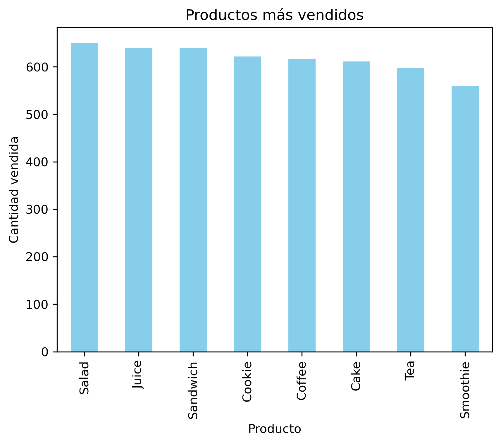
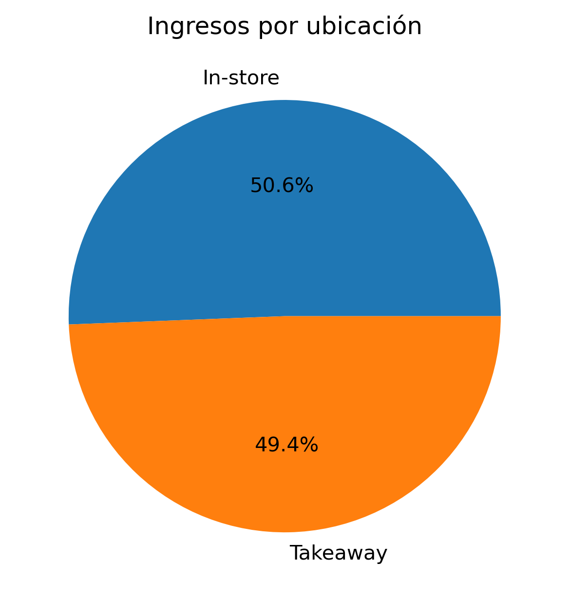
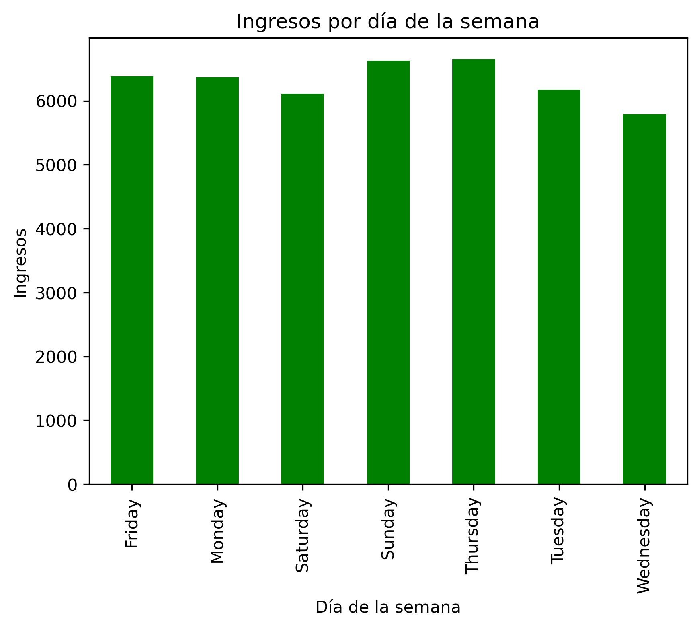
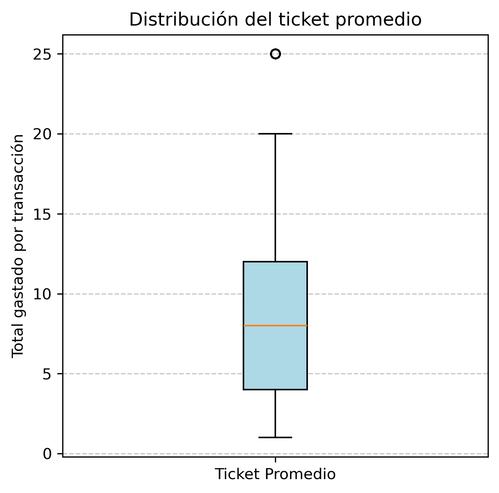
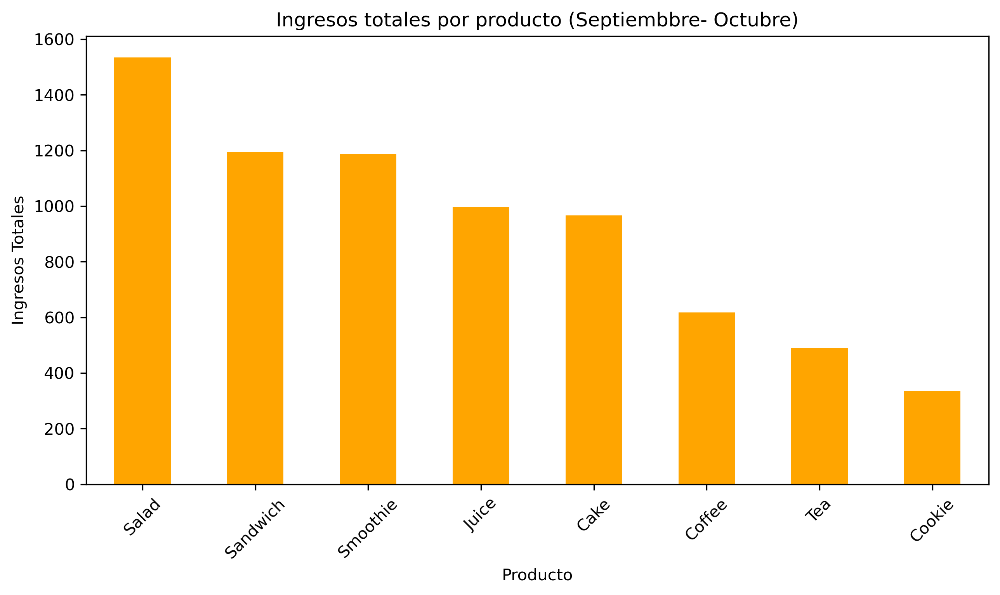

---

## 🔍 Pasos Realizados

### 1. Carga y Exploración de Datos 📥
   - Inspección inicial para detectar problemas de formato, valores nulos o inconsistencias.  
   - Análisis de tipos de datos y necesidad de transformaciones.

### 2. Limpieza de Datos 🧹
   - Corrección de valores incorrectos o inconsistentes (ej. "ERROR", "UNKNOWN").
   - Eliminación de duplicados y manejo adecuado de valores nulos.
   - Conversión de tipos de datos (fechas, valores numéricos, etc.).
   - Creación del archivo `clean_cafe_sales.csv` con los datos procesados.

### 3. Análisis Exploratorio de Datos (EDA) 📊
   - **Patrones de ventas:** Identificación de los productos más vendidos. 🍰🥤  
     
   - **Ingresos:** Evaluación por ubicación y métodos de pago. 💳💸  
     
   - **Tendencias temporales:** Ventas por día de la semana 📅  
     
   - **Distribución del ticket promedio** y su variación en el tiempo.  
     
   - **Rentabilidad de productos:** Análisis de ingresos generados por categoría.  
     

### 4. Visualización de Datos 📈
   - Gráficos de barras y circulares para representar patrones clave.
   - Boxplots para analizar distribuciones de ventas y ticket promedio.
   - Uso de colores y diseños adecuados para mejorar la interpretación.

---

## 🛠️ Herramientas Utilizadas
- 🐍 **Python**
- 🧑‍💻 **Pandas**
- 📊 **Matplotlib**
- 🔢 **Numpy**

---

## 📌 Cómo Usar este Proyecto

### 1. Clonar el repositorio  
```bash
git clone https://github.com/andreacampog/analisis-ventas-cafe.git
cd analisis-ventas-cafe
